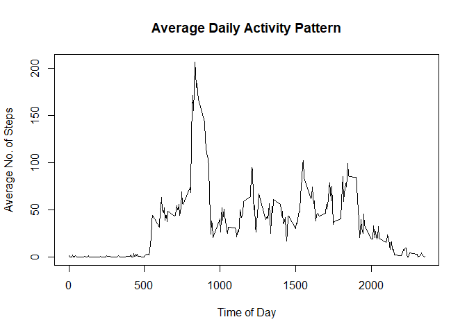

## Loading and preprocessing the data
Assumes that activity.zip is in working directory


```r
library(data.table)
unzip("activity.zip",exdir=getwd())
MyData<-fread("activity.csv",data.table=FALSE)
MyData$date <- as.Date(MyData$date)
MyData$DateTime <-
  as.POSIXct(
    paste(MyData$date, 
          sprintf("%04.0f", MyData$interval)), #coerce interval to be 4 digits long, with leading zeroes (military time)
    format="%Y-%m-%d %H%M") #convert to time
```


## What is mean total number of steps taken per day?
### Sum steps by day, and create histogram of daily steps 

```r
MySumsByDay<-aggregate(steps ~ date, FUN=sum, data=MyData)
hist(MySumsByDay$steps,breaks=10, main="Histogram of Daily Step Totals",xlab="Steps")
```

<!-- -->

### What are the mean and median daily step counts?

```r
print(paste0("Mean number of steps per day is ",round(mean(MySumsByDay$steps),2)," steps."))
```

```
## [1] "Mean number of steps per day is 10766.19 steps."
```

```r
print(paste0("Median number of steps per day is ",round(median(MySumsByDay$steps),2)," steps."))
```

```
## [1] "Median number of steps per day is 10765 steps."
```

## What is the average daily activity pattern?
### Time series plot of the average number of steps taken

```r
MyIntervalAvgs<-aggregate(steps ~ interval,FUN=mean,data=MyData)
plot(x=MyIntervalAvgs$interval,y=MyIntervalAvgs$steps,type="l",xlab="Time of Day",ylab="Average No. of Steps",main="Average Daily Activity Pattern")
```

<!-- -->

### The 5-minute interval that, on average, contains the maximum number of steps

```r
MaxRow<-which(MyIntervalAvgs$steps == max(MyIntervalAvgs$steps))
MaxInterval1<-MyIntervalAvgs$interval[MaxRow]
MaxInterval2<-MyIntervalAvgs$interval[MaxRow+1]
MaxInterval1<-format(strptime(substr(as.POSIXct(sprintf("%04.0f",MaxInterval1), 
                                  format="%H%M"), 12, 16), '%H:%M'), '%I:%M %p')
MaxInterval2<-format(strptime(substr(as.POSIXct(sprintf("%04.0f",MaxInterval2), 
                                  format="%H%M"), 12, 16), '%H:%M'), '%I:%M %p')
print(paste0("The 5 minute interval that, on average, has the most steps is between ",MaxInterval1," and ",MaxInterval2))
```

```
## [1] "The 5 minute interval that, on average, has the most steps is between 08:35 AM and 08:40 AM"
```

## Imputing missing values
Total number of missing values:

```r
sum(is.na(MyData$steps))
```

```
## [1] 2304
```

### We'll impute missing values for a given interval with the average values for that interval from days where that interval isn't missing.  MyData_imputed will be a version of the original dataset, but with imputed values

```r
MyData_imputed <- MyData
MyData_imputed$steps[is.na(MyData_imputed$steps)] <- MyIntervalAvgs$steps[match(MyData$interval[is.na(MyData$steps)],MyIntervalAvgs$interval)]
```

### Create histogram of daily steps after imputation, and report mean and median daily step counts after imputing.

```r
MySumsByDay_imputed<-aggregate(steps ~ date, FUN=sum, data=MyData_imputed)
hist(MySumsByDay_imputed$steps,breaks=10, main="Histogram of Daily Step Totals (with imputations)",xlab="Steps")
```

<!-- -->

```r
print(paste0("Mean number of steps per day is ",round(mean(MySumsByDay_imputed$steps),2)," steps."))
```

```
## [1] "Mean number of steps per day is 10766.19 steps."
```

```r
print(paste0("Median number of steps per day is ",round(median(MySumsByDay_imputed$steps),2)," steps."))
```

```
## [1] "Median number of steps per day is 10766.19 steps."
```
After imputing, the mean is the same but now the median has increased to equal the mean.

## Are there differences in activity patterns between weekdays and weekends?
###Panel plot comparing the average number of steps taken per 5-minute interval across weekdays and weekends, after adding variable to identify weekend vs. weekday.

```r
library(ggplot2)
MyData$DayOfWeek <- weekdays(MyData$date)
MyData$Weekend <- ifelse(MyData$DayOfWeek %in% c("Saturday","Sunday"), "Weekend","Weekday")
MyIntervalAvgsByDay<-aggregate(steps ~ interval + Weekend,FUN=mean,data=MyData)
MyPlot <- ggplot(MyIntervalAvgsByDay,aes(interval,steps)) + 
  geom_line(size=2) + 
  facet_grid(Weekend ~ .) + 
  ggtitle("Average Daily Activity Pattern") + 
  xlab("Time of Day") + 
  ylab("Average No. of Steps") + 
  theme(axis.text=element_text(size=12),
        axis.title=element_text(size=14,face="bold"),
        plot.title = element_text(hjust = 0.5))
print(MyPlot)
```

<!-- -->
